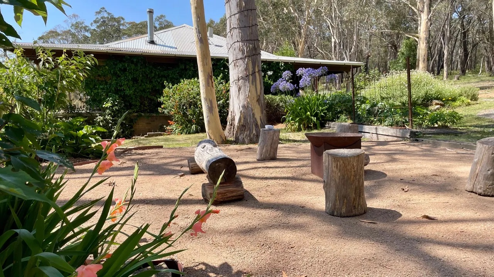

# The Burrows of Penrose

A companion website for a private Southern Highlands homestead.

This repo holds the public-facing home for **The Burrows of Penrose**: a calm, polished little site that gives guests a feel for the place before they arrive. It is intentionally simple, fast, and easy to host on GitHub Pages, with a design that lets the property do most of the talking.

---

## The homestead

The Burrows of Penrose is a private 100-acre rural retreat in the Southern Highlands of New South Wales, near Bundanoon. It is a place for unhurried stays: a big country kitchen, open paddocks, bush and water, generous quiet, and the sort of wildlife that reminds you how far from the city you really are.

[Visit the website](index.html)

<p>
  
</p>

---

## What it does well

- Introduces the homestead with warm, guest-friendly copy
- Showcases the house, land, wildlife, and surrounding area
- Points visitors to your Airbnb listing for secure booking
- Works as a static site: no build step, no framework, no fuss
- Is responsive, accessible, and easy to adapt with your own photos and words

---

## What's in the box

```
index.html            Home page and main invitation
about.html             The Homestead — story, land, and essentials
gallery.html           Photo gallery
area.html              The Area — local guides and things to do
book.html              Stay & Book page
404.html               Friendly "page not found"

guides/
  events.html          Southern Highlands events calendar
  food-and-drink.html  Wineries, restaurants, and pubs
  nature.html          Lookouts, walks, and natural attractions
  wildlife.html        Wildlife around the homestead

css/site.css           Shared styling
js/site.js             Mobile menu and light motion
images/                Placeholder images to replace with your own

CNAME                  Your custom domain
.nojekyll              GitHub Pages helper
robots.txt, sitemap.xml SEO files to update with your domain
```

---

## Quick start

1. Create a GitHub repository for the site.
2. Upload the contents of this folder.
3. In **Settings → Pages**, choose **Deploy from a branch**.
4. Select `main` and `/ (root)`, then save.
5. Wait a moment and the site will be live.

---

## Make it yours

### 1) Update the Airbnb link

Every booking button currently points to a placeholder Airbnb URL. Replace it with your real listing across the site.

### 2) Replace the photos

The `images/` folder contains placeholders. Swap each file for your own photo using the same filename. The homepage hero should be your strongest image: wide, inviting, and unmistakably the place.

### 3) Personalise the copy

Look for `<!-- EDIT: ... -->` comments in the HTML. They mark the passages and facts you will want to confirm, refine, or replace with your own voice.

### 4) Update the domain

If you use a custom domain, set `CNAME`, then update `robots.txt` and `sitemap.xml` to match.

---

## About the tone

The site is written like a good open source README: clear, welcoming, and practical. It just happens to be doing a different job — inviting people into a place that is peaceful, rural, and worth the journey.

---

## Notes

- Everything uses relative links, so you can open `index.html` locally in a browser.
- Fonts load from Google Fonts.
- The site is designed to feel good on phones, tablets, and desktops.
